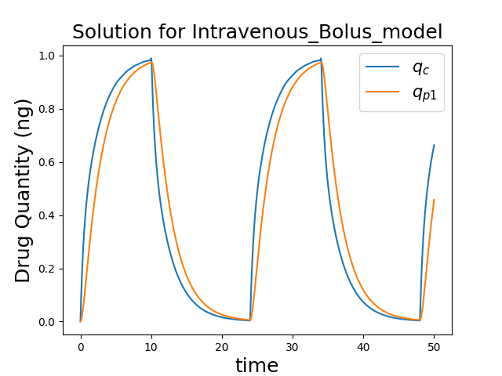
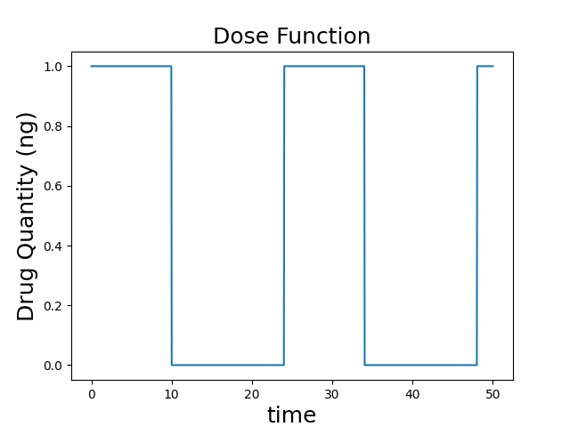

# pkmodel by 4the-right-side

A new python package which models different methods of drug delivery and returns a graph  showing the drug quantity in each compartment over time.  It also provides a reference plot illustrating the dose function. The package can be easily installed using 'pip' via the command line. 

## Explanation of Pharmacokinetics

"The field of Pharmacokinetics (PK) provides a quantitative basis for describing the delivery of a drug to a patient, the diffusion of that drug through the plasma/body tissue, and the subsequent clearance of the drug from the patient's system. PK is used to ensure that there is sufficient concentration of the drug to maintain the required efficacy of the drug, while ensuring that the concentration levels remain below the toxic threshold (See Fig 1)." (DTC Software Engineering Course, 2024)

For further technical description of the model, documentation is available at: https://pkmodel-cool.readthedocs.io/en/latest/index.html

## Installation and running package

At the command line, type:

    pip install --upgrade -i https://test.pypi.org/simple/ pkmodel 

You may need to add '--upgrade' if you have already tried to install previously.

Once installed, run the following command to see options available and their correct syntax:

    python -m pkmodel -h

To run the package, type the following command, adding appropriate settings:

    python -m pkmodel 

## Interpretation of graphs

Here is an example of the output for the parameters:     
    'name': 'Intravenous_Bolus_model',
    'Q_p1': 1.0,
    'V_c': 1.0,
    'V_p1': 1.0,
    'CL': 1.0,
    'ka': 0.0,
    'X': 1.0,
    'Dosing_Type': 'Bolus'

   

with the input dosing function:

## Members
1. Anita 
2. Pao
3. Callum
4. Ed
